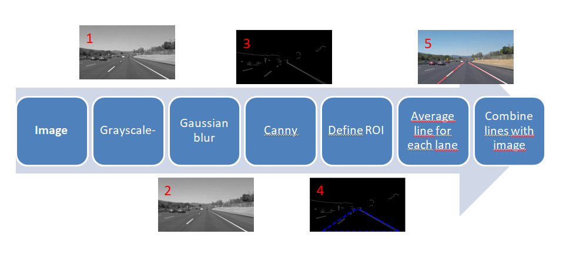

# **Finding Lane Lines on the Road** 

## Writeup Template

### You can use this file as a template for your writeup if you want to submit it as a markdown file. But feel free to use some other method and submit a pdf if you prefer.

---

**Finding Lane Lines on the Road**

The goals / steps of this project are the following:
* Make a pipeline that finds lane lines on the road
* Reflect on your work in a written report

[//]: # (Image References)

[image1]: ./examples/grayscale.jpg "Grayscale"

---

### Reflection

### 1. Describe your pipeline. As part of the description, explain how you modified the draw_lines() function.

My pipeline consisted of 5 main [steps]./library/workflow.jpg

First, I converted the images to grayscale, then I use gaussian_blur to smooth the image.
In the following step, I detect the edges using Canny function,at this point it is very important to export edges detected (as an image) to see if the lane lines are fully detected or not. 
As I was not satisfied with the manual Canny threshold tuning, I tried to find a way to automatically define those thresholds. 
The [auto Canny] (https://www.pyimagesearch.com/2015/04/06/zero-parameter-automatic-canny-edge-detection-with-python-and-opencv/) allows to save this effort and is efficient at least for the test images and the two first videos.
Next, I use some hardcoded values to define the ROI and then I seperate left lane's lines from right ones using the slope sign. 
Having the lines for each side I tried to find the averaged line using a 1st degree polynomial. 
Finally I draw lines on the picture, this is achieved by combining them with the original image using addWeighted function. 

### 2. Identify potential shortcomings with your current pipeline

It would be nice to try making the process work for the challenge video.
I tried solutions like 2nd polnomial, averaging slopes and intercepts by weighting according to y coordinates (slopes and intercepts of the bootom half of ROI are more relevant) but all this failed.
Cahnging the process to just output edges on black backround (Canny edges) I noticed that there is so much noise in the image that inexistant lines in the ROI are being detected.  

### 3. Suggest possible improvements to your pipeline

The process could be improved by filtring the image and getting rid of these unwanted edges.
